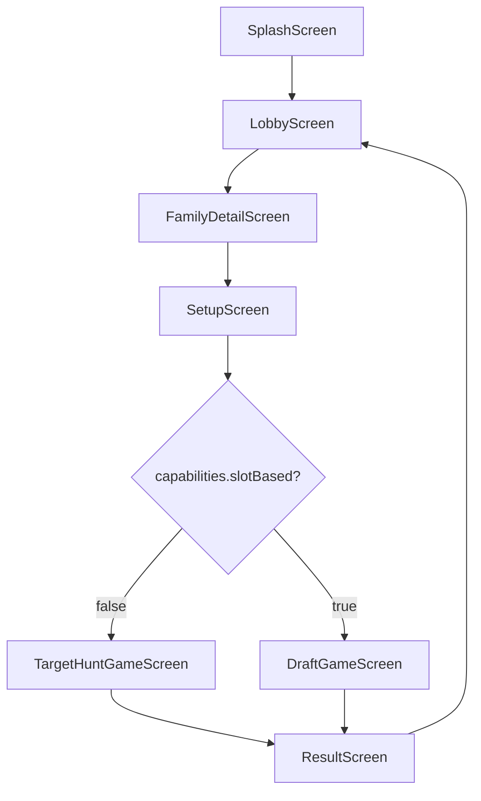

# Flutter — Ekran Haritası ve Navigasyon

Her ekran için hangi API'nin çağrılacağı, hangi state'in tutulacağı ve sonraki ekrana geçiş koşulları.

---

## Navigasyon akışı



---

## Ekran listesi

### 1. SplashScreen

| Özellik | Değer |
|---------|-------|
| API | `GET /api/v1/meta/locales`, `GET /api/v1/meta/i18n-bundle` |
| State | `participantId`, `locale`, i18n cache |
| Sonraki | LobbyScreen |

**Yapılacaklar:**
- SharedPreferences'tan `participantId` yükle veya oluştur
- i18n bundle çek ve memory'de tut
- Health check (opsiyonel): `GET /health`

---

### 2. LobbyScreen

{{figma:lobby}}

| Özellik | Değer |
|---------|-------|
| API | `GET /api/v1/game-families` |
| Swagger | [game-families → list](/swagger) |
| State | `List<GameFamilySummary>` |
| Sonraki | FamilyDetailScreen (`code` ile) |

**UI:** Kart grid — `title`, `description`, `imageUrl`

---

### 3. FamilyDetailScreen

{{figma:family-detail}}

| Özellik | Değer |
|---------|-------|
| API | `GET /api/v1/game-families/:code` |
| Swagger | [game-families → getByCode](/swagger) |
| State | `GameFamilyDetail`, `catalogVersion` cache |
| Sonraki | SetupScreen (oyun seçimi) |

**UI:** Oyun listesi — her kartta `title`, `capabilities.selectionCount` badge

---

### 4. SetupScreen

{{figma:setup}}

| Özellik | Değer |
|---------|-------|
| API | Yok (katalog verisinden) |
| State | `game`, `scope`, `playerMode`, `targetValue` |
| Sonraki | `POST /api/v1/game-sessions` → Game ekranı |

**Dinamik UI (`capabilities`):**

| Alan | UI bileşeni |
|------|-------------|
| `requiresScope: true` + Target Hunt | Scope picker (`CAREER`, `RANDOM` → shuffle ikonu) |
| `requiresScope: true` + Draft | **Draft scope picker** (`DRAFT_CLUB`, `DRAFT_COUNTRY`) → [flutter-draft-scope.md](./flutter-draft-scope.md) |
| `hasTarget: true` | Target input |
| `playerMode: BOTH` | SINGLE / MULTIPLAYER |
| `slotBased: true` | Draft game screen |

**Draft scope picker zorunlu** — seçilmeden "Oyunu Başlat" disabled.

---

### 5. TargetHuntGameScreen

| Özellik | Değer |
|---------|-------|
| API | `GET .../players`, `POST .../actions` |
| State | `session`, `stateVersion`, arama query |
| Sonraki | `completed: true` → ResultScreen |

**UI bileşenleri:**
- Hedef değer göstergesi (`targetValue`)
- Progress: `selectionCount / capabilities.selectionCount`
- Oyuncu arama + seçim listesi
- Seçilen oyuncular listesi (`selections`)

Detay → [flutter-target-hunt.md](./flutter-target-hunt.md)

---

### 6. DraftGameScreen

| Özellik | Değer |
|---------|-------|
| API | `GET .../players?slotCode=`, `POST .../actions` |
| State | `session`, `currentRound`, `activeSlotCode`, `lineup` |
| Sonraki | 6 tur tamamlanınca → ResultScreen |

**UI bileşenleri:**
- **Tur banner** — `currentRound.entity` (logo, isim, tur X/6)
- 1-2-2-1 formasyon (6 slot)
- Aktif slot vurgusu
- Tur değişiminde banner animasyonu
- `picksInRound / picksRequired` göstergesi (multiplayer)

Detay → [flutter-draft.md](./flutter-draft.md) · [flutter-draft-scope.md](./flutter-draft-scope.md)

---

### 7. ResultScreen

| Özellik | Değer |
|---------|-------|
| API | `GET .../result` veya `GET .../results` (multiplayer) |
| State | `GameResult` (sealed class) |
| Sonraki | LobbyScreen |

**Branch:** `result.kind` → TargetHuntResultView veya DraftResultView

Detay → [api-results.md](./api-results.md)

---

### 8. PlayerSearchSheet (modal / bottom sheet)

| Özellik | Değer |
|---------|-------|
| API | `GET .../players?q=&slotCode=` |
| Parametreler | `q` (min 2), `page`, `limit`, `slotCode` (draft) |
| Callback | `onPlayerSelected(playerId)` |

`alreadySelected: true` satırları gri/disabled.

---

## State yönetimi önerisi

Riverpod / Bloc / Provider fark etmez; minimum state:

```dart
class GameSessionState {
  final GameSession session;
  final bool isLoading;
  final String? activeSlotCode;
  final String searchQuery;
  final DraftRoundContext? currentRound;  // draft: tur entity
}
```

Session her action sonrası `stateVersion` güncellenmeli.

---

## Ek rehberler

| Konu | Sayfa |
|------|-------|
| Local multiplayer header | [flutter-local-multiplayer.md](./flutter-local-multiplayer.md) |
| Medya URL | [flutter-assets.md](./flutter-assets.md) |
| Oyun kuralları | [flutter-definition-snapshot.md](./flutter-definition-snapshot.md) |
| App resume | [flutter-session-resume.md](./flutter-session-resume.md) |
| Tasarım token'ları | [flutter-design-system.md](./flutter-design-system.md) |
| Test JSON | [flutter-fixtures.md](./flutter-fixtures.md) |
